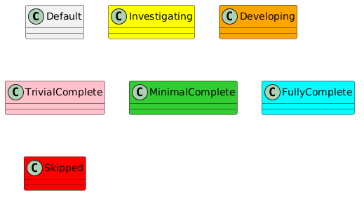

# FAST Robotics - Robot Framework: ROS v1 Middleware

- [FAST Robotics - Robot Framework: ROS v1 Middleware](#fast-robotics---robot-framework-ros-v1-middleware)
- [Architecture](#architecture)
- [Features](#features)
- [ToDo](#todo)
- [Setup](#setup)


# Architecture


# Features
| Status | Feature                                             |
| ------ | --------------------------------------------------- |
| DRAFT  | [Core](include/robot_framework_ros/doc/Core.md)     |
| DRAFT  | [Example Node](core/ExampleNode/doc/ExampleNode.md) |


# ToDo
| Item                                          |
| --------------------------------------------- |
| Change message definition namespace           |
| Add code coverage for Example Node            |
| Add guide for creating new node from BaseNode |
| Doxygen hosted documentation                  |
| Doxygen for messages?                         |
| User time loops                               |

# Setup

Pre-Requisites:

- Ubuntu system running 20.04 LTS

1. Clone this repo.
2. Run the following:

```bash
cd <repo>
./scripts/setup_ide.sh
./scripts/setup_robot.sh
```
