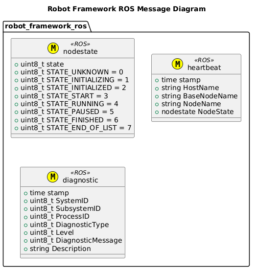
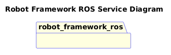

[](https://github.com/fastrobotics/robot_framework_ros/actions/workflows/build-test.yml)

# FAST Robotics - Robot Framework: ROS v1 Middleware

- [FAST Robotics - Robot Framework: ROS v1 Middleware](#fast-robotics---robot-framework-ros-v1-middleware)
- [Requirements](#requirements)
- [Architecture](#architecture)
- [Interfaces](#interfaces)
- [Systems](#systems)
- [Features](#features)
- [Setup](#setup)
- [Build](#build)
  - [Build and run Unit Tests](#build-and-run-unit-tests)
- [Generate Code Coverage (after running Build and run Unit Tests)](#generate-code-coverage-after-running-build-and-run-unit-tests)
- [Execution](#execution)
- [Documentation](#documentation)
  - [Interface Documentation](#interface-documentation)
- [Templates](#templates)

# Requirements
[Requirements](doc/Requirements/Requirements.md)

# Architecture


# Interfaces




# Systems
| Status | System                                                                     |
| ------ | -------------------------------------------------------------------------- |
| DRAFT  | [Base Machine System](Systems/BaseMachine/doc/System-BaseMachine.md)       |
| DRAFT  | [Navigation System](Systems/Navigation/doc/System-Navigation.md)           |
| DRAFT  | [User Interface System](Systems/UserInterface/doc/System-UserInterface.md) |
| DRAFT  | [Safety System](Systems/Safety/doc/System-Safety.md)                       |


# Features
| Status | Feature                                             |
| ------ | --------------------------------------------------- |
| DRAFT  | [Core](include/robot_framework_ros/doc/Core.md)     |
| DRAFT  | [Example Node](core/ExampleNode/doc/ExampleNode.md) |

# Setup

Pre-Requisites:

- Ubuntu system running 20.04 LTS

1. Clone this repo using:
```bash
git clone --recurse-submodules https://github.com/fastrobotics/robot_framework_ros.git
cd robot_framework_ros
git submodule update --remote
```
2. Run the following:

```bash
cd <repo>
./scripts/setup_ide.sh
./scripts/setup_robot.sh
```

# Build
To build, run the following:
```bash
cd <workspace>
catkin_make
```

## Build and run Unit Tests
```bash
cd <workspace>
catkin_make
catkin_make tests
catkin_make run_tests
```

# Generate Code Coverage (after running [Build and run Unit Tests](#build-and-run-unit-tests))

```bash
cd <repo>
source repo_config
./dev_tools/scripts/dev_tools.sh code_coverage
```

# Execution
To launch the main content, run the following (after following [Build](#build))
```bash
cd <workspace>
source devel/setup.bash
roslaunch robot_framework_ros robot.launch
```

# Documentation
## Interface Documentation
[Interface Documentation](doc/InterfaceDefinitions/InterfaceDefinition.md)

# Templates

This project makes extensive use of cookiecutter templates.

| Template  | Folder                 | Use Case                   |
| --------- | ---------------------- | -------------------------- |
| System    | `templates/System/`    | Used to create a System    |
| Subsystem | `templates/Subsystem/` | Used to create a Subsystem |
| Node      | `templates/Node/`      | Used to create a Node      |


To use these templates, run:

```bash
cookiecutter <Template Folder containing cookiecutter.json> -o <Output Directory>
```
