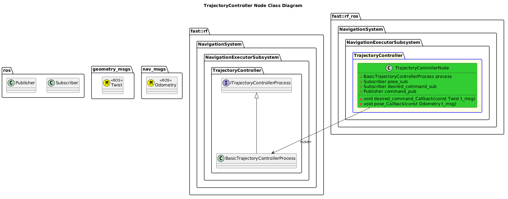

[Navigation Executor](../../../doc/Subsystem-NavigationExecutor.md)
- [TrajectoryController Node](#trajectorycontroller-node)
- [Architecture](#architecture)
  - [Class Diagram](#class-diagram)
- [Configuration](#configuration)

# TrajectoryController Node

# Architecture


## Class Diagram


# Configuration
To configure the node, construct a yaml file that is loaded after this System's config/config.yaml file, that has the following syntax:
```yaml
navigation:
  navigation_executor:
    trajectory_controller:
      nodeTrajectoryController:
        max_output: 10.0
        min_output: -10.0
        K_P: 1.0
        K_I: 0.0
        K_D: 0.0
        sensor_scale: 1.0
```

Note: For any key that you do not wish to update, simply remove it and it won't be over-written.