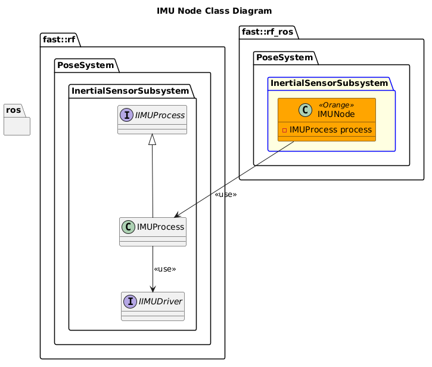

`@compare_tag Node-Document v0.1`
[Inertial Sensor Subsystem](../../../doc/Subsystem-InertialSensor.md)
- [IMU Node](#imu-node)
- [Architecture](#architecture)
  - [Class Diagram](#class-diagram)
  - [Middle-Ware Libraries](#middle-ware-libraries)
- [Configuration](#configuration)

# IMU Node

# Architecture

## Class Diagram

## Middle-Ware Libraries
The IMU Node uses the [IMUProcess](https://github.com/fastrobotics/robot_framework/blob/master/Systems/Pose/Subsystems/InertialSensor/Processes/IMU/doc/Process-IMU.md) Middleware Library. 

# Configuration
The IMU Node has the following configuration options
| Parameter            | Description                                                                                                         |
| -------------------- | ------------------------------------------------------------------------------------------------------------------- |
| `robot_namespace`    | The namespace to launch the node under.                                                                             |
| `verbosity_level`    | The logger verbosity level.                                                                                         |
| `loop1_rate`         | How fast to update the `process`.  This will include whatever the process needs read the sensor, so should be fast. |
| `loop2_rate`         | How fast to publish the IMU data.                                                                                   |
| `imu_type`           | The type of IMU connected.                                                                                          |
| `topic_imu`          | The topic to publish the IMU data.                                                                                  |
| `topic_magnetometer` | The topic to publish the Magnetometer data.                                                                         |
