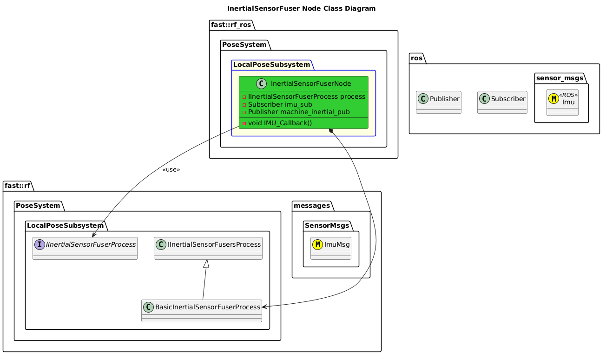

`@compare_tag Node-Document v0.1`
[Local Pose Subsystem](../../../doc/Subsystem-LocalPose.md)
- [InertialSensorFuser Node](#inertialsensorfuser-node)
- [Architecture](#architecture)
  - [Class Diagram](#class-diagram)
- [How It Works](#how-it-works)

# InertialSensorFuser Node

# Architecture

## Class Diagram

# How It Works
- When a new IMU message is received, the Machine Inertial Data is re-computed and immediately transmitted.
