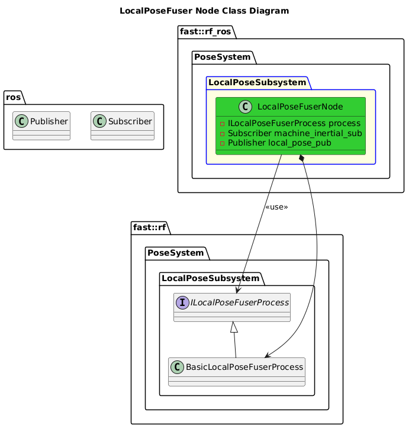

[Local Pose Subsystem](../../../doc/Subsystem-LocalPose.md)
- [LocalPoseFuser Node](#localposefuser-node)
- [Architecture](#architecture)
  - [Class Diagram](#class-diagram)
- [How It Works](#how-it-works)

# LocalPoseFuser Node

# Architecture

## Class Diagram

# How It Works
Whenever new Inertial Machine Data is received, a new Local Pose will be computed and published.