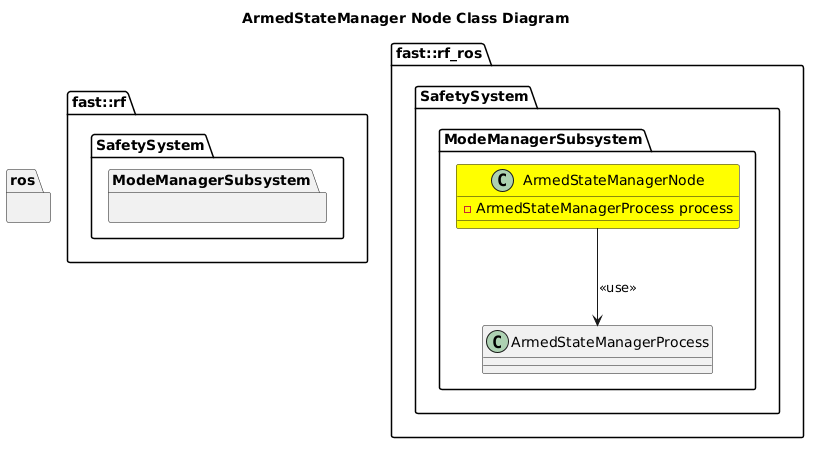

[Mode Manager Subsystem](../../../doc/Subsystem-ModeManager.md)
- [ArmedStateManager Node](#armedstatemanager-node)
- [Architecture](#architecture)
  - [Class Diagram](#class-diagram)

# ArmedStateManager Node

# Architecture

## Class Diagram
