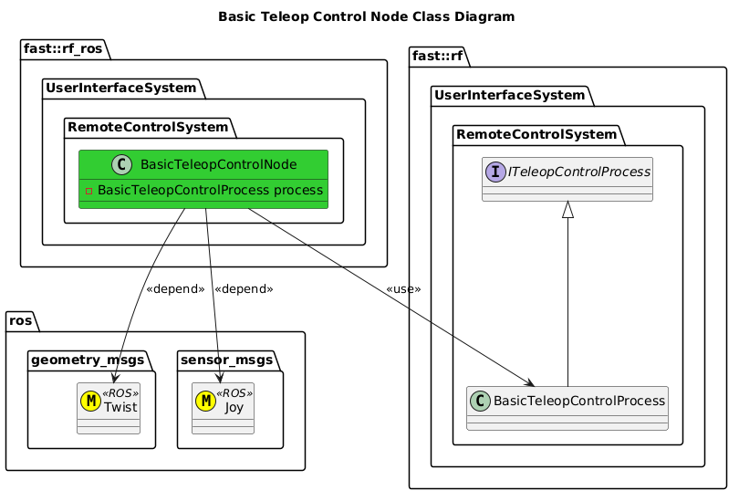

[Nodes - Teleop Control](../../doc/Nodes-TeleopControl.md)
- [Basic Teleop Control Node](#basic-teleop-control-node)
- [Architecture](#architecture)
  - [Class Diagram](#class-diagram)

# Basic Teleop Control Node

# Architecture

## Class Diagram
