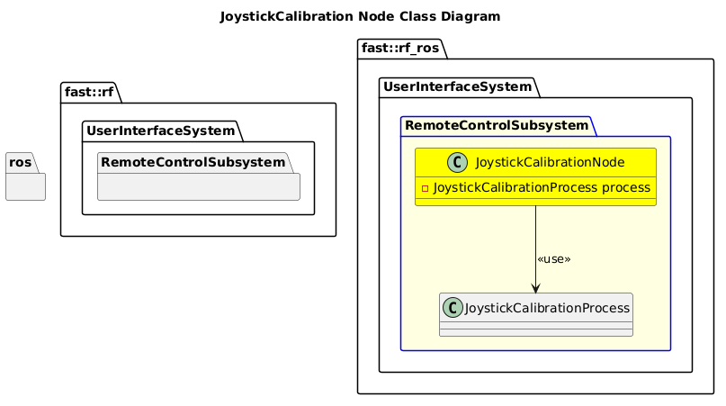

[Teleop Control Nodes](../../doc/Nodes-TeleopControl.md)
- [JoystickCalibration Node](#joystickcalibration-node)
- [Architecture](#architecture)
  - [Class Diagram](#class-diagram)
- [Usage Example:](#usage-example)

# JoystickCalibration Node

# Architecture


## Class Diagram



# Usage Example:
```bash
rosrun robot_framework_ros nodeJoystickCalibration _x_deadband:=0.2 _y_deadband:=0.2 _throttle_deadband:=0.2 _output_file_path:=/home/david/git/component_database/Components/Electrical/JoysticsGamepads/ThrustmasterJoystick/ThrustmasterJoystick.yaml
```