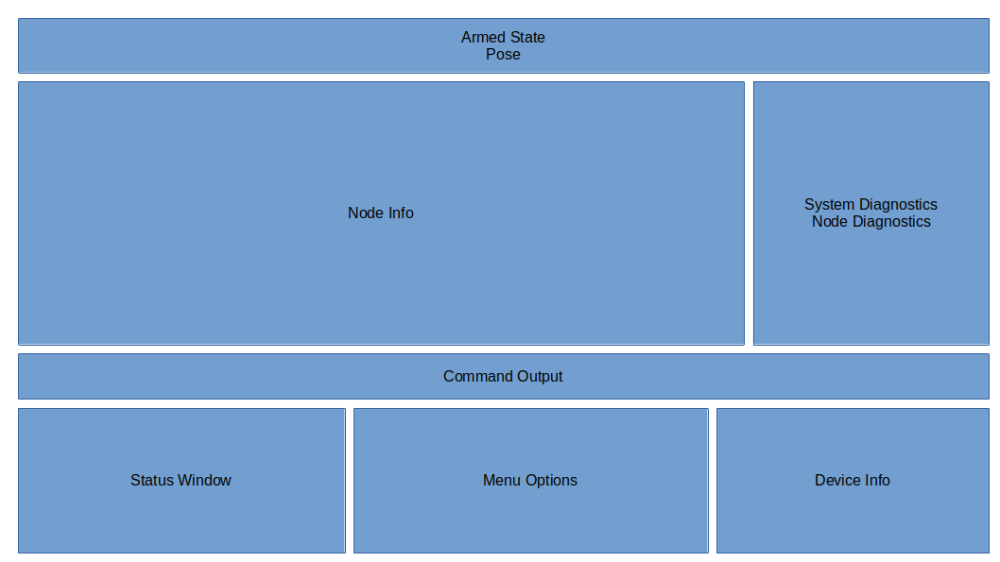
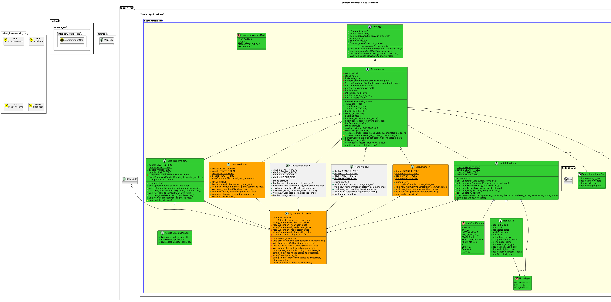

[Applications](../../doc/Applications.md)

# System Monitor

## Overview
The System Monitor Application provides a portable graphical interface to inspect the status of a Robot.

## Requirements
The System Monitor has the following requirements:
| Requirement                                                                                          |
| ---------------------------------------------------------------------------------------------------- |
| Can be run directly from command line                                                                |
| Can be run from a remote command line (ssh)                                                          |
| Is not required to be run on a robot.  Can be killed without any negative effect on robot operation. |
 
## Graphic Design


## Execution
To run, do the following:
```bash
rosrun robot_framework_ros syste_monitor _robot_namespace:=/robot 
```
## Software Design

### Class Diagram


## Windows
The following Windows are supported in the System Monitor:
### Header
The Header Window provides quick run-time status, such as:
- Armed State
- Current Time
- Pose

### Node Info
The Node Info Window provides details on every Node running on the system.


### System/Node Diagnostics
This window displays Diagnostic details, either for the entire system, or for the specific Node.

### Command Output
This small window displays the status of various commands requested from the System Monitor (such as changing the Node Logger Level, requesting a snapshot, etc).

### Status Window
This is a generic Window that provides details like:
- What kind of data collection is running
- What the name of the application is
- Source Code information

### Menu Options
This window displays to the user what options are available.  Note that this window is dynamic as the operations available can change over time.

### Device Info
This window displays device health information.