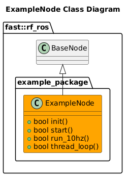

[README](../../../README.md)
- [Example Node](#example-node)
- [Node Architecture](#node-architecture)
  - [Class Diagram](#class-diagram)

# Example Node
An Example Node is provided that can be copied into the appropriate space with all required functionality

# Node Architecture

## Class Diagram

