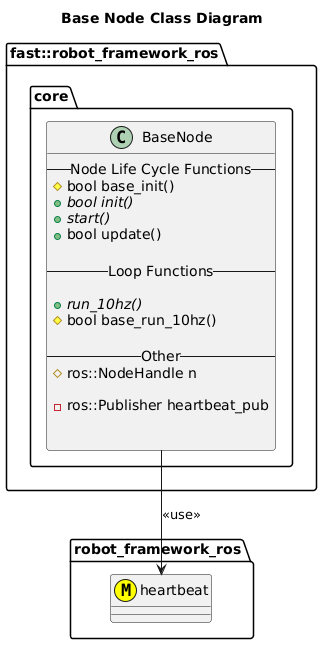
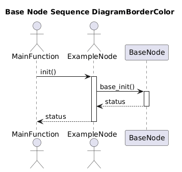

[Core Content](../Core.md)

- [Base Node](#base-node)
- [Architecture](#architecture)
  - [Class Diagrams](#class-diagrams)
  - [Sequence Diagrams](#sequence-diagrams)

# Base Node

# Architecture

## Class Diagrams

## Sequence Diagrams
