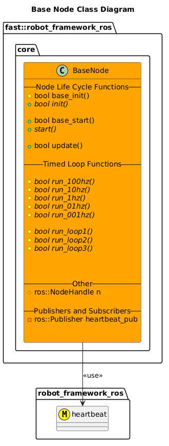
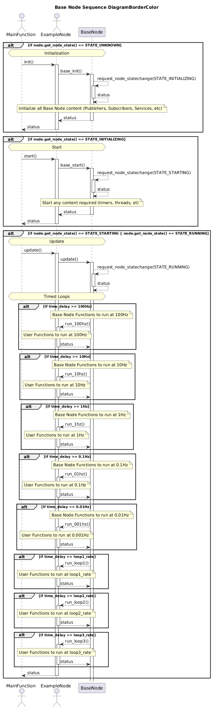
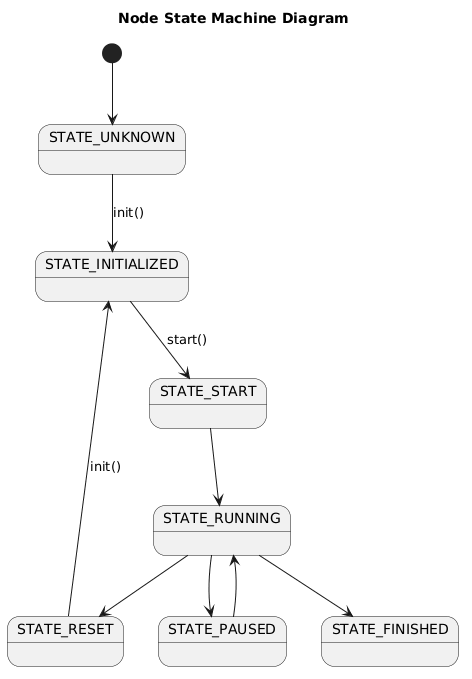

[Core Content](Core.md)

- [Base Node](#base-node)
- [Architecture](#architecture)
  - [Class Diagrams](#class-diagrams)
  - [Sequence Diagrams](#sequence-diagrams)
  - [State Machine Diagrams](#state-machine-diagrams)
- [Features](#features)
  - [Timed Loops](#timed-loops)
    - [Pre-Defined Loops](#pre-defined-loops)
      - [Loop: 100Hz](#loop-100hz)
      - [Loop: 10Hz](#loop-10hz)
      - [Loop: 1Hz](#loop-1hz)
      - [Loop: 0.1Hz](#loop-01hz)
      - [Loop: 0.01Hz](#loop-001hz)
    - [User-Defined Loops](#user-defined-loops)

# Base Node

# Architecture

## Class Diagrams

## Sequence Diagrams

## State Machine Diagrams

# Features
## Timed Loops
The Base Node provides 2 types of "Timed Loops": Pre-Defined Rate Loops and User-Defined Rate Loops.
Note that with the Pre-Defined Rate Loops, the Base Node will do other things behind the scenes, detailed below:

### Pre-Defined Loops
#### Loop: 100Hz
Base Node does not currently do anything extra here.

#### Loop: 10Hz
Base Node does the following:
- Publishes a Heartbeat Message

#### Loop: 1Hz
Base Node does not currently do anything here.

#### Loop: 0.1Hz
Base Node does not currently do anything here.

#### Loop: 0.01Hz
Base Node does not currently do anything here

### User-Defined Loops
The Base Node provides 3 Loops that the User Node can set the rate and directly run at their discretion, named, Loop1, Loop2, Loop3.

Common convention here is that Loop1 is the "slowest" and Loop3 is the fastest, but that's not required.

To disable any of these User-Defined Loops, don't define a loop rate.